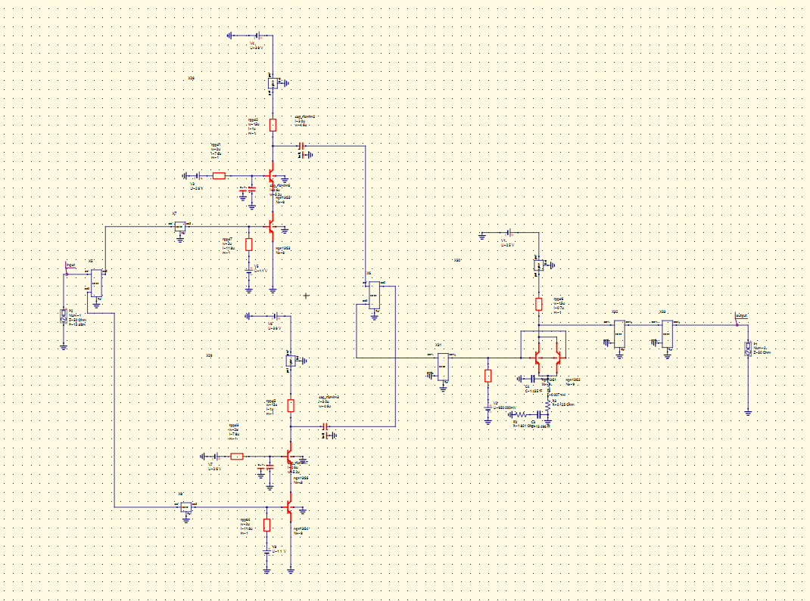
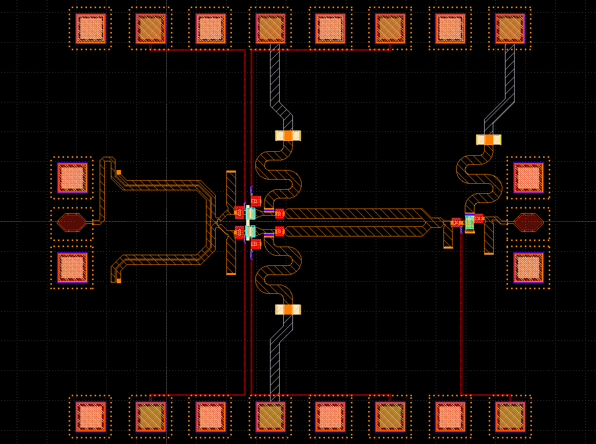
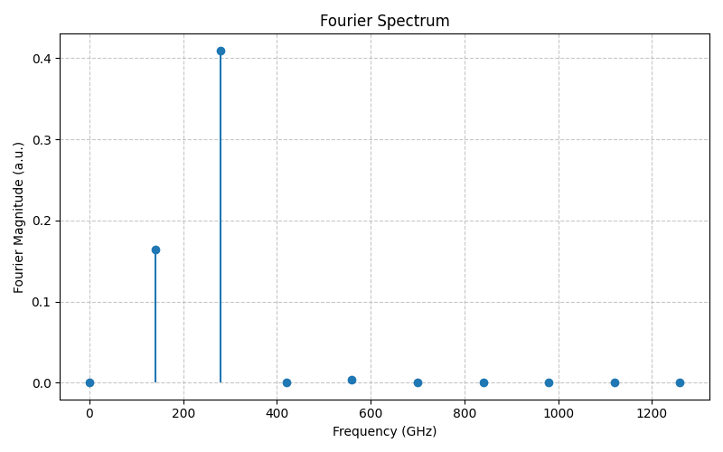
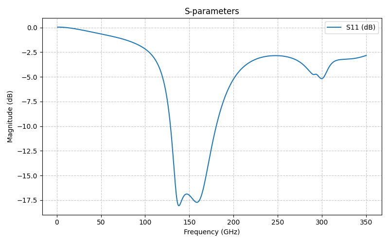
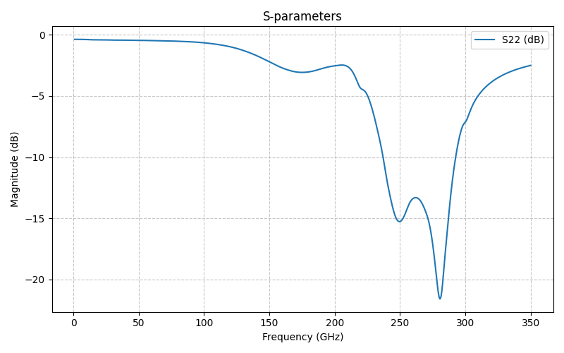

*************************************
Design Data – Cascode Frequency Doubler
*************************************

.. contents::
   :local:
   :depth: 2

Overview
========
This section documents the **cascode-based 140→280 GHz frequency doubler** implemented in the IHP SG13G2 (130 nm SiGe BiCMOS) open PDK. The design uses a differential **DOHCL** network to suppress the fundamental and enhance the 2nd harmonic, with on‑chip input/output matching networks, RF probing pads, and bias decoupling for stable operation.

.. note::
   This page captures the schematic, layout, transient/Fourier verification of the 2nd‑harmonic component, and small‑signal matching (S‑parameters) around the input (≈140 GHz) and output (≈280 GHz).

Process / Stack (summary)
=========================
- **PDK:** IHP SG13G2 (open PDK)  
- **Active devices:** SiGe HBTs (350/450 GHz class)  
- **Routing:** microstrip over ground with topmetal as signal where applicable
- **Probing:** GSG RF pads for RF I/O; DC pads for bias rails

High‑Level Block
================
- Differential **balun** → **cascode doubler core** (with DOHCL)
- **Input match** centered near the fundamental
- **Output network** transforming to 50 Ω near the 2nd harmonic
- Bias tees/chokes with local **decoupling** to maintain AC ground at RF

Schematic
=========

   **Figure 1 – Cascode frequency doubler schematic.**
   The differential input drives a cascode core. DOHCL sections present an open at the fundamental and a low‑impedance path at the 2nd harmonic. Bias networks and coupling capacitors are indicated for each device stack.

Layout (Top‑Level)
==================

   **Figure 2 – Layout overview.**
   Symmetric routing is used from the balun to the core. The DOHCL lines and output transformer/matching are centered to minimize imbalance. RF GSG pads are placed at both ports; DC pads sit along the top/bottom edges with short, decoupled bias feeds.

Transient → Fourier (2nd Harmonic Evidence)
===========================================

   **Figure 3 – Fourier spectrum from transient waveform.**
   The spectrum shows a strong component near **2×f\ :sub:`IN`** (target ≈280 GHz), with the fundamental suppressed by the DOHCL‑assisted core and output network.

Small‑Signal Matching
=====================

Input Port (around 140 GHz)
---------------------------

   **Figure 4 – S\ :sub:`11` (input match).**
   Input network targets a return‑loss minimum close to the fundamental to improve drive efficiency and minimize reflected power into the balun and source.

Output Port (around 280 GHz)
----------------------------

   **Figure 5 – S\ :sub:`22` (output match).**
   Output matching presents approximately **50 Ω** near the 2nd harmonic (≈280 GHz) to extract power efficiently while preserving DOHCL suppression at the fundamental.

Key Design Notes
================
- **DOHCL tuning:** Line lengths were swept to minimize the fundamental at the core output while maximizing the 2nd harmonic at the load.
- **Symmetry:** Balanced routing and equalized parasitics in the differential paths reduce even/odd‑mode skew, improving cancellation of undesired tones.
- **Bias decoupling:** Local MIM decaps near the chokes provide a firm AC ground at RF; values were chosen to push the LC self‑resonance safely above the operating band of interest.
- **Probing & ESD:** RF pads are isolated from DC rails; DC pads include series resistors/RCs as needed. Guard rings and ground stitching vias are used to confine return currents.

Data Checklist (what’s in this page)
====================================
- Schematic snapshot (Fig. 1)
- Top‑level layout (Fig. 2)
- Transient‑derived Fourier spectrum showing 2× tone (Fig. 3)
- Input and output return‑loss plots (Figs. 4–5)

Attribution
===========
.. image:: _static/IHP_logo.png
   :align: center
   :width: 220
   :alt: IHP Logo

Design implemented using the **IHP SG13G2 Open PDK** and open‑source tooling where applicable.
