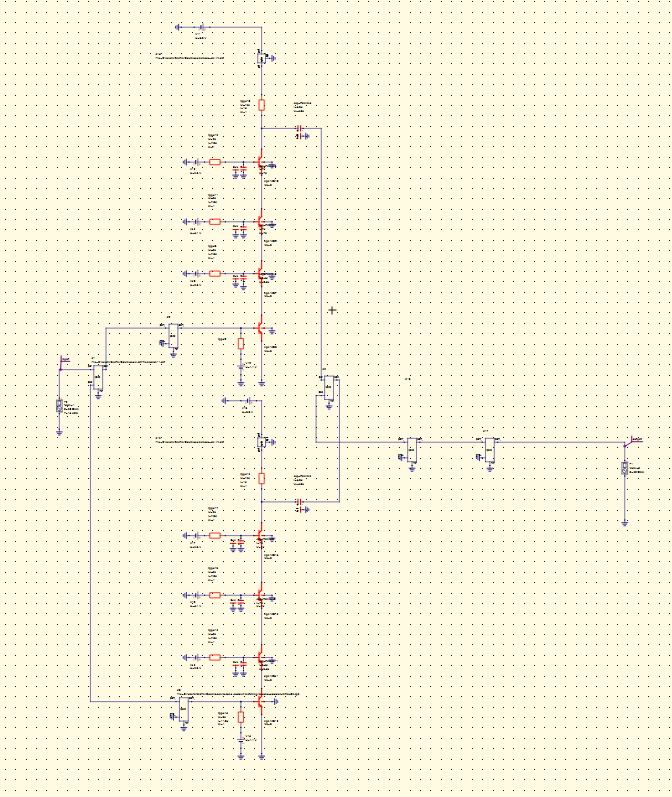
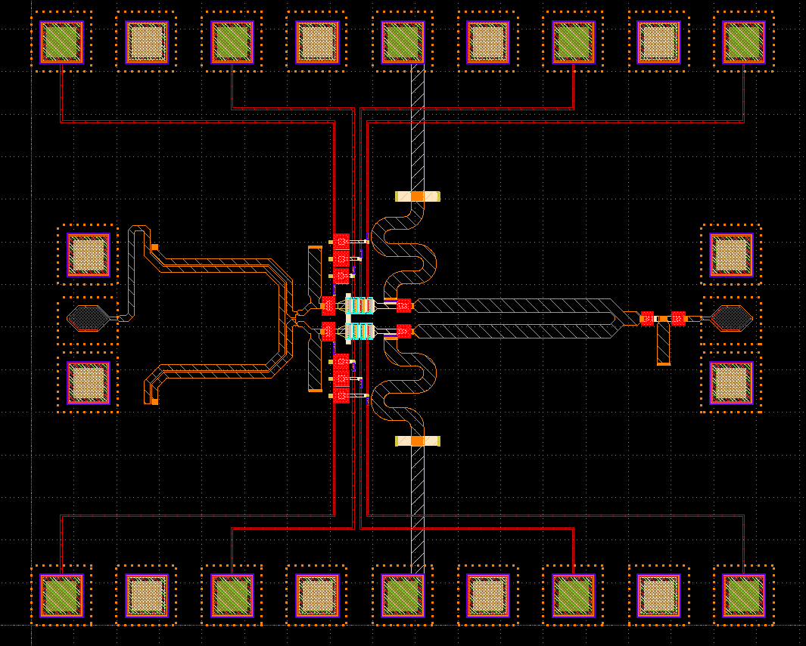
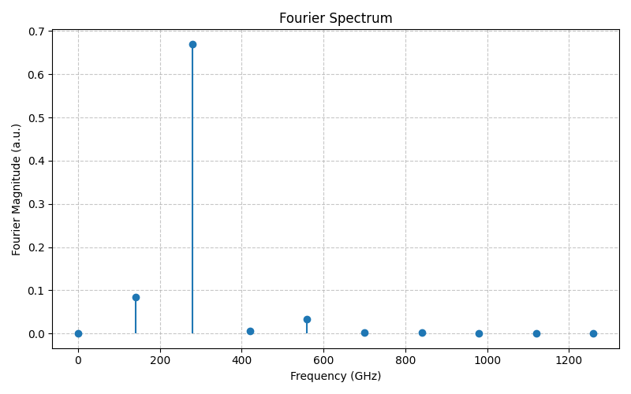
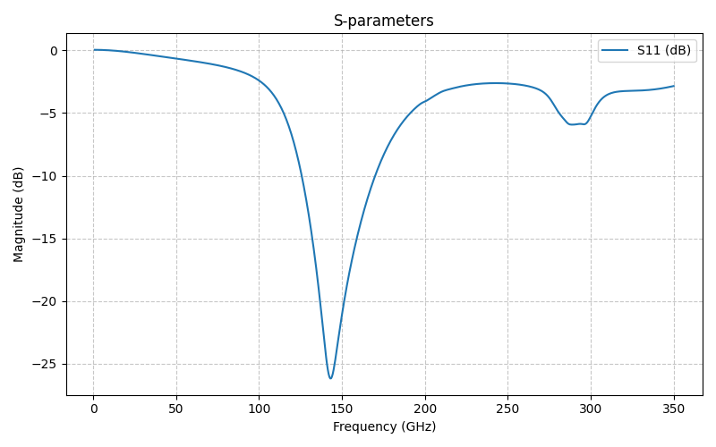
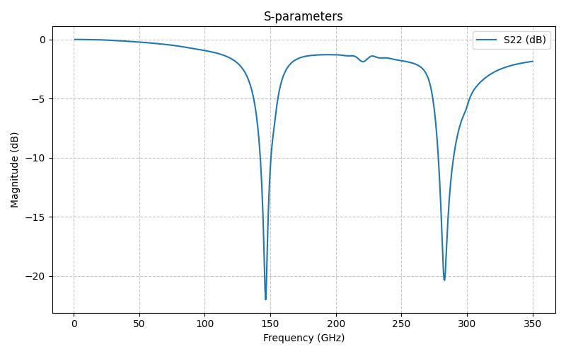

**************************************
Design Data – Quadcode Frequency Doubler
**************************************

.. contents::
   :local:
   :depth: 2

Overview
========
This section documents the **quadcode‑based 140→280 GHz frequency doubler** in the IHP SG13G2 (130 nm SiGe BiCMOS) open PDK. The core uses a **four‑transistor stacked (quadcode)** topology to increase voltage swing and improve 2nd‑harmonic generation, while a differential **DOHCL** network suppresses the fundamental and routes the even harmonic to the load. Input and output networks are tuned around ≈140 GHz and ≈280 GHz, respectively.

.. note::
   This page includes the schematic, full‑chip layout, transient→Fourier evidence of 2× tone, and small‑signal matching at both ports.

Process / Stack (summary)
=========================
- **PDK:** IHP SG13G2 (open PDK)
- **Active devices:** SiGe HBTs (350/450 GHz class)
- **Routing:** microstrip over ground (top metal signal)
- **Pads:** Differential RF GSG pads; separated DC pads with decoupled bias feeds

High‑Level Block
================
- Differential **balun** → **quadcode doubler core** (with DOHCL)
- **Input match** centered near 140 GHz
- **Output match** presenting ≈50 Ω near 280 GHz
- Bias tees/chokes with local **MIM decaps** for AC ground

Schematic
=========

   **Figure Q1 – Quadcode frequency doubler schematic.**
   Four stacked devices form the nonlinear core. Fundamental rejection is assisted by DOHCL sections; coupling and bias components are included per stack.

Layout (Top‑Level)
==================

   **Figure Q2 – Layout overview.**
   The RF feed from the balun to the quadcode core is fully symmetric. Output matching and DOHCL lines are centered; RF pads are on left/right with DC pads along top/bottom rails.

Transient → Fourier (2nd Harmonic Evidence)
===========================================

   **Figure Q3 – Fourier spectrum from transient waveform.**
   A dominant spectral line at **≈2×f\ :sub:`IN`** confirms efficient 2nd‑harmonic generation; the fundamental is strongly suppressed.

Small‑Signal Matching
=====================

Input Port (around 140 GHz)
---------------------------

   **Figure Q4 – S\ :sub:`11` (input match).**
   The input network places the return‑loss minimum near the drive frequency to maximize excitation of the quadcode core.

Output Port (around 280 GHz)
----------------------------

   **Figure Q5 – S\ :sub:`22` (output match).**
   Output network presents ≈**50 Ω** near the 2nd harmonic for efficient power extraction while keeping the fundamental terminated per DOHCL design.

Key Design Notes
================
- **Quadcode stack:** Higher effective swing across the nonlinear core increases 2× content; bias points are distributed across the stack for safe device stress.
- **DOHCL tuning:** Section lengths swept to null the fundamental at the core output and peak the even harmonic.
- **Symmetry & routing:** Matched differential paths and compact via stitching help maintain balance and reduce even/odd‑mode skew.
- **Bias decoupling:** Local MIM decaps near chokes provide a stiff AC ground; values chosen to keep LC self‑resonance out of the operating band.

Data Checklist (what’s in this page)
====================================
- Schematic snapshot (Fig. Q1)
- Top‑level layout (Fig. Q2)
- Transient‑derived Fourier spectrum verifying 2× tone (Fig. Q3)
- Input and output return‑loss plots (Figs. Q4–Q5)
